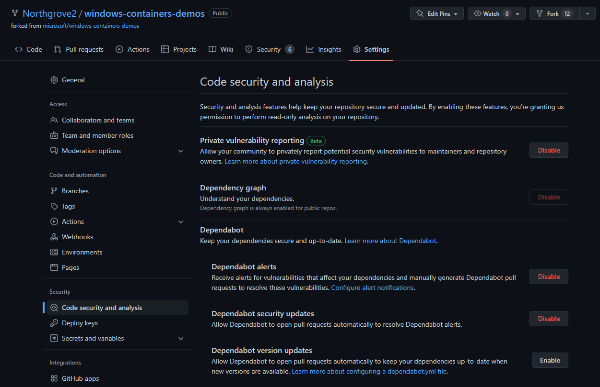
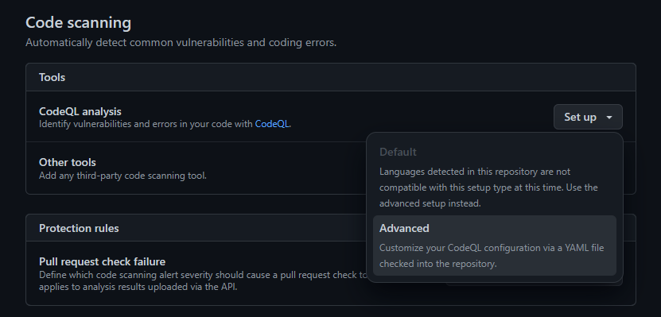
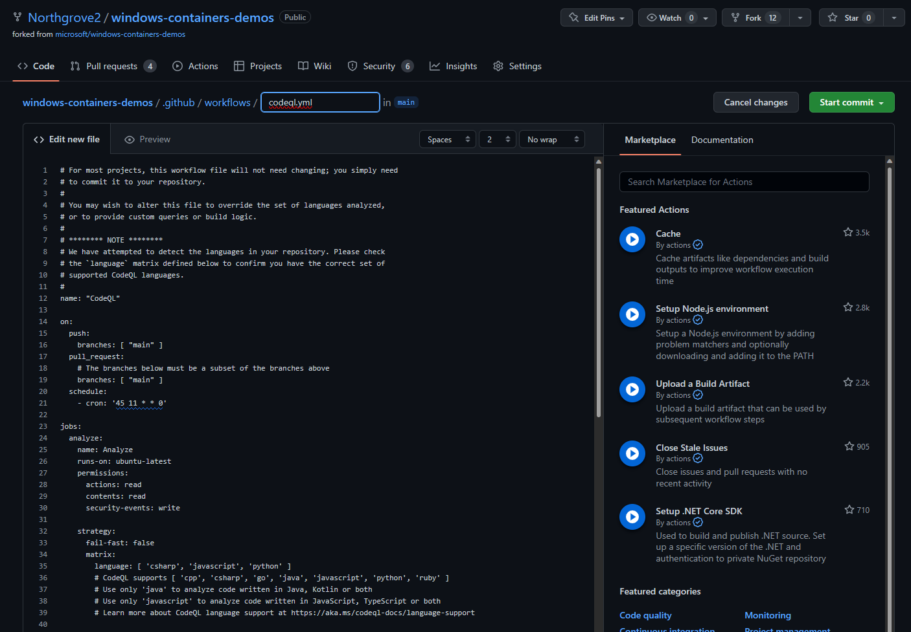

# Module 15 – Integrating Defender for DevOps with GitHub Advanced Security

#### 🎓 Level: 200 (Intermediate)
#### ⌛ Estimated time to complete this lab: 45 minutes

## Objectives
In this exercise, you will learn how to configure GitHub Connector in Defender for DevOps.

### Exercise 1: Preparing the Environment

If you alredy finished [Module 1](https://github.com/Azure/Microsoft-Defender-for-Cloud/blob/main/Labs/Modules/Module-1-Preparing-the-Environment.md) of this lab, you can skip this exercise, otherwise plesae finish at least Exercise 1, 2 and 3 from Module 1.

### Exercise 2: Creating an GitHub Trial account

1.	Open an In-Private session in your web browser and navigate to [https://github.com/join](https://github.com/join)
2.	If this is the first time you're creating GitHub account, enter the UserName, Password and email address and follow the screen to create a new account 
3.	Type your Account email address and Password and login to your GitHub environment.

### Exercise 3: Obtain trial of GitHub Enterprise Cloud account
#### NOTE: GitHub Advanced Security is available for Enterprise accounts on GitHub Enterprise Cloud and GitHub Enterprise Server. Some features of GitHub Advanced Security are also available for public repositories on GitHub.com. For more information, see GitHub’s products.

For the purpose of this lab, we’re setting up a trial to evaluate GitHub Enterprise Cloud. To get a Trial version of GitHub Enterprise Cloud, click [here](https://github.com/organizations/enterprise_plan?ref_cta=Try%2520Enterprise&ref_loc=user_drawer_side_panel&ref_page=Header+Avatar). This will be a 30-day trial and you don’t need to provide a payment method during the trial unless you add GitHub marketplace apps to your organization that require a payment method. 

#### Create an Github organization

1. From the link above, choose **Enterprise cloud**

2. Create a new Github account if needed, or click **Sign in** if you already have one.

3. After signed in, create a new github organizaion

4. Welcome to your new Enterprise Organization and a 30 day trial

#### Fork a couple of repos

To have some security issues to detect, you could **fork** a couple of repos. Fork these two repos into your organization:

>
> https://github.com/github/code-scanning-javascript-demo
>
> https://github.com/microsoft/windows-containers-demos
>

For each repo do:

1. Click on the **Fork** button in top right corner
   
2. Choose your Organization as the owner of the new repo
   
3. In the new repository, forked from the original. Click on **Setting** and then **Code security and Analyst** from the left sidebar.
4. Enable **Dependabot alerts**, **Dependabot security updates**, **Dependency graph**, **Private vulnerability reporting** and **Secret scanning** (located at the bottom)
   
5. In the **Code scanning** section, Click **Set up** right to **CodeQL analysis** and choose **Advanced** (Choose Default if available)
   
6. Commit the **CodeQL.yml** file by clicking **Start Commit** in top right corner. Type in an apropriate heading and description. Click **Commit new file**
   
7. To see the code scanning running, click on **Actions** in the top menu bar.

Repeat the same steps for the other Github repo.

### Exercise 4: Connecting your GitHub organization

1.	Login to your Azure Portal and navigate to Defender for Cloud dashboard
2.	In the left navigation pane, click **Environment settings** option
3.	Click the **Add environment** button and click **GitHub (preview)** option. The **Create GitHub connection** page appears as shown the sample below.

4.	Type the name for the connector, select the subscription, select the Resource Group, which can be the same you used in this lab and the region. 
5.	Click **Next:select plans >** button to continue.
6.	In the next page leave the default selection with **DevOps** selected and click **Next: Authorize connection >** button to continue. The following page appears:

7.	Click **Authorize** button. Login to github with the trial account just created.

8.  Now Click **Install** button under Install Defender for DevOps app. If this is the first time you’re authorizing your DevOps connection, you’ll receive a pop-up screen, that will ask you confirmation of which repository you'd like to install the app. 

9. Choose **All repositories** or **only select repositories** as per your choice and click on **Install**

10. Once you click on install, you’ll receive another pop-up window requesting to enter the password inorder to confirm access   

11. Back to the Azure portal, you’ll notice that the extension is installed > Click on **Review and Create** button to continue.  
12. Navigating to the **Environment Settings** under **Microsoft Defender for Cloud**, you’ll notice the GitHub Connection was successfully created. 

Browse the **DevOps Security** section from the side bar to see the status of your github repos (it could take some time before the status is reflected in Defender for Cloud).

### Exercise 5: Configure the Microsoft Security DevOps GitHub action:

To setup GitHub action:
1.	Login to the GitHub repo that you created in Exercise 4.
2.	Select a repository on which you want to configure the GitHub action.
3.	Select **Actions** as shown in the image below 

4.	Select **New Workflow**

5.	In the text box, enter a name for your workflow file. For example **msdevopssec.yml**

6.	Copy and paste the following sample action workflow into the **Edit new file** tab. 

~~~~~~
name: MSDO IaC Scan

on:
  # Triggers the workflow on push or pull request events but only for the main branch
  push:
    branches: [ main ]
    
  pull_request:
    branches: [ main ]

  workflow_dispatch:

jobs:
  security:
    runs-on: windows-latest
    continue-on-error: false
    strategy:
      fail-fast: true
    permissions:
      actions: read
      contents: read
      security-events: write
      
    steps:
    - uses: actions/checkout@v3
    
    - uses: actions/setup-dotnet@v3
      with:
        dotnet-version: |
          5.0.x
          6.0.x
          
    - name: Run Microsoft Security DevOps
      uses: microsoft/security-devops-action@preview
      continue-on-error: false
      id: msdo
      with:
        categories: 'IaC'

    - name: Upload alerts to Security tab
      uses: github/codeql-action/upload-sarif@v2
      with:
        sarif_file: ${{ steps.msdo.outputs.sarifFile }}
~~~~~~~

7.	Click on **Start Commit** **Commit new file**

The process can take up to one minute to complete. 
A workflow gets created in your repositories github folder with the above copied yml file 

8.	Select **Actions** and verify the new action is running/completed running. 

9.	Once this job completes running, navigate to the Security tab > Click on Code scanning 

NOTE: if you don’t see anything is because your code scanning feature is disabled in GitHub. Refer to the prerequisites section of this lab to review the instructions to enable. 

10.	If you see No code scanning alerts here, In the filter of Code scanning tab, choose is:open tool: Notice the available tools Defender for DevOps uses.

11.	Code scanning findings will be filtered by specific MSDO tools in GitHub. These code scanning results are also pulled into Defender for Cloud recommendations.

### Continue with the next lab: [Module 99 – Simulate Incidents](Module-99-simulate-incidents.md)
