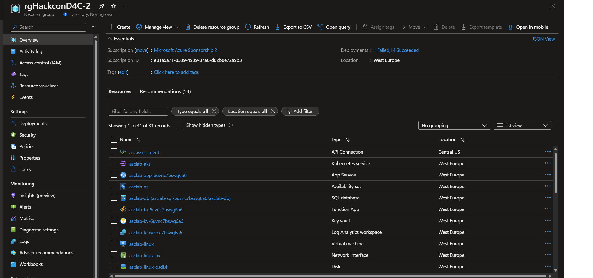

# AzureSecurityTraining
Azure Security Training is a two day workshop.
Day 1: Defender for Cloud
Day 2: Microsoft Sentinel

# Prerequesites for Azure Security Training

> ❗These prerequesites **MUST** be done **BEFORE** you show up for the first day ❗ 
> The lab environment will be used both for Defender for Cloud and Sentinel.

To get full use of these days you need to come prepared! That means that you must have prepared the lab environment in forhand. Which means that you **must** deploy this lab to a new subscription **before** you meet up for the workshop.

Module 1 represents the prerequesites. the whole module must be completed!
- Step 1: create a new Trial Subscription - this can only be done if you are eligible for it and have not created a free subscription before. If you are *not* eligibel for a free subscription you can use any other paid subscription you my have or have available thru your employer. The lab will be created within a resourcegroup and can easly be deleted after the workshop.

> NB! if you are using a free azure subscription, dont provision the lab so early that you have used all your free credits befor the workshop starts.

- Step 2: Provision the resources in this lab
- Step 3: Enable Microsoft Defender for Cloud
- Step 4: Enable Microsoft Sentinel
 
- Step 4: Bring your computer to the workshop on the workshop day, and remember your username and password so you have access to the lab.

### Objectives
Create a new Microsoft Account enable with Azure Trial Subscription 
This section is intended to deploy Azure resources in an automated way to get you started quickly or in case you need to re-provision your environment.

#### Make sure ...
Before you start this lab, make sure you have the following prerequisites:
- **Supported web browser** (Microsoft Edge, Google Chrome, Safari, Firefox Mozilla)
    - For using these labs, **we recommend to open an incognito/in-private browser session** on your machine and login to Azure Portal to avoid conflicts with existing Azure Subscriptions/environments if already being used.
 - **Microsoft Account** - If you do not have an existing account Sign-up to create a free account: https://signup.live.com
  
 
 

## Step 1: Creating an Azure Trial Subscription

To use these labs, you should have Azure Subscription Trial, this allows you to get:
- **12 months of free products** - Get free access to popular products like virtual machines, storage, and databases in your first 30 days, and for 12 months after you upgrade your account to pay-as-you-go pricing.
- £150 credit/$200 credit - Use your credit to experiment with any Azure service in your first 30 days - beyond the free product amounts.
- **No automatic charges** – During the registration process, you should enter your credit card information to complete the identity verification process. 
> ⚠️ Warning: you won't be charged unless you choose to upgrade the subscription.
Before the end of your first 30 days, you'll be notified and have the chance to upgrade and start paying only for the resources you use beyond the free amounts.
> The organizor or instructor, etc taks no responsibility for any cost this lab my generate in your subscription.

> If you have trouble creating a free Azure Subscription Trial, contact kjetil.nordlund@microsoft.com to get a Azure Promo pass to exchange into a subscription with free credit (en Azure Tenant is still required)

### Instructions:
1. Open an **In-Private** session in your web browser and navigate to https://azure.microsoft.com/en-us/free
2. On the main part of this page, click **Start free** and use your Microsoft Account credentials to you to login to Azure Portal.
Important - Make sure you are not logged in with your corporate user.
3. Type your Microsoft Account email address and then click on **Next**.
4. On the **Stay signed in** message, click **Yes**.
5. At the **Try Azure for free** page, type in your details following the 4-steps (your profile, identity verification by phone, identity verification by card, agreement). Once you complete all steps, click on **Sign Up** button to complete the subscription creation process.
6. On the **You’re ready to start with Azure** page, click on **Go to portal** button. Now you should have Azure Subscription named **Azure subscription 1** including owner permissions.

 
 

## Step 2: Provisioning resources

> ❗ Important:  
> You should also be accessing the Microsoft Defender for Cloud labs in the same private window. Otherwise, link from the lab will be open on a non-private window. 

As part of the exercises mentioned in this lab guide, you will create an environment using an automated deployment based on ARM template.
An ARM template is a JavaScript Object Notation (JSON) file that defines the infrastructure and configuration for your project. The template uses declarative syntax, which lets you state what you intend to deploy without having to write the sequence of programming commands to create it.
The following list of resources will be deployed during the provisioning process (including dependencies like disks, network interfaces, public IP addresses, etc.):

Name | Resource Type | Purpose
-----| ------------- | -------
asclab-win | Virtual machine | Windows Server
asclab-linux | Virtual machine | Linux Server
asclab-as | Availability set | Availability set for the 2-VMs
asclab-aks | Kubernetes service | Testing container services capabilities
asclab-app-[uniqestring] | App Service | App service to be used for web app, function app
asclab-sql-[uniqestring] | SQL server | To be using for the sample database
asclab-as | SQL database | Sample database based on AdventureWorks template
asclab-kv-[uniqestring] | Key vault | Demonstrating Key Vault related recommendations and security alerts
asclab-fa-[uniqestring] | Function App | Demonstrating related built-in and custom security recommendations
asclab-la-[uniqestring]	| Log Analytics workspace | Log Analytics workspace used for data collection and analysis, storing logs and continuous export data
asclab-nsg | Network security group | Required for Just-in-Time access and security recommendations
asclab-splan | App Service plan | Demonstrating related security recommendations
asclab-vnet | Virtual network | Default virtual network for both Azure VM and for network related recommendations
asclabcr[uniqestring] | Container registry | Demonstrating related security recommendations
asclabsa[uniqestring] | Storage account | Demonstrating related security recommendations
SecurityCenterFree | Solution | Default workspace solution used for Microsoft Defender for Cloud free tier

After the deployment of the template, you can check the progress of your deployment if you click on your created resource group details, then click on Deployments (1 deploying).
Continue with the exercise below until the deployment has completed.
  

 

1. Prepare your lab environment by clicking on the blue **Deploy to Azure** button below :

2.	You will be redirected to Azure Portal > custom deployment page where you should specify mandatory fields for deployment.
3.	On the subscription field, select **Azure subscription 1**.
4.	On the resource group field, click on **Create new** and name it as **asclab** (you can pick any name you want or keep the default).
5.	On the parameters section, select "Europe West" as the data center **region** (all downstream resources will be created in the same region as the resource group).
6. Select a password that will be used across services (such as credentials for virtual machines and SQL database)
> Notice that password must be between 12 and 72 characters and have 3 of the following: 1 lower case, 1 upper case, 1 number and 1 special character.
7.	Click **Review + create** to start the validation process. Once validation passed, click on **Create** to start the ARM deployment on your subscription.
8.	The deployment takes about **10 minutes** to complete. 

> The *deployment is in progress* page continues to update and show the resources being uploaded to the environment assuming the deployment is successful.  
> During the deployment, additional resource group will be created automatically for Kubernetes resources named as “asclab-aks”. 

You can also check the progress of your deployment if you click on your created resource group details, then click on **Deployments** (*1 deploying*).  

When the deployment is complete, you should see the following:

2. Do the same deployment of this deployment file (will add some additional servers for the CSMP module):
   
   

 
 

## Step 3: Enabling Microsoft Defender for Cloud

#### Subscription upgrade and agents installation
1. Open **Azure Portal** and navigate to **Microsoft Defender for Cloud** blade.
2. Click on **Getting started** page from the left pane, On the **Upgrade** Tab, select subscription (Azure subscription 1) and press **Upgrade**.
   >Note: You may need to wait for a few minutes for the upgrade to complete.
3. Select both **Azure subscription 1**, and also the **workspace name** underneath it. Click on **Upgrade** to upgrade.
   

4. Select the **Azure Subscription 1** and click **Install agents** to install agents to the resources in the subscription.

   

#### Get the status of the Defender coverage on the subscription and the workspace
1. Return to Microsoft Defender for Cloud blade and Click on **Environment settings**. Click the down arrow on **Azure** to show the subscription, and then click the down arrow on **Azure Susbcription 1** to show the workspace. Notice the Defender coverage is 12/12 plans for the subscription and 2/2 plans for the workspace, meaning that you are now fully protected using Microsoft Defender for Cloud.
    

2. Click on **Azure subscription 1**, and notice how all Microsoft Defender for Cloud plans are enabled. 
3. For Servers, make sure that **Plan 2** is selected as Plan / pricing.
4. To check for **SQL servers on machines**, in Databases, click on **Select types** and make sure **SQL servers on machines** is toggled **On**. **Azure SQL Databases** should be toggled **On** too. 

> If you need to enable individual plans, first ensure that the Microsoft Defender for Cloud plans blue box on the right hand side is selected, and then you can select the specific Defender plans underneath.

5. Exit that screen, and then select the workspace from the previous screen. 
   
    

6. Ensure that plans for **Servers** and **SQL Servers on machines** are turned **On**.
7. Select **Data Collection** on the side panel
8. Make sure *All Events** are selected

#### Configure *Settings & Monitoring* in Microsoft Defender for Cloud

1. On the **Defender plans** page page for **Azure Subscription 1**, select **Settings & Monitoring** on the top menu.

2. On the **Settings & Monitoring**, set **Log Analytics agent/Azure Monitor Agent** to **On** (if it's not already set to On)

3. Click **Edit configuration** under the configuration column.
4. On the workspace configuration section, use the **Connect Azure VMs to a different workspace** option to select your workspace **xxx-lab-xxx** (which has been created by the ARM template).
5. Under **Security events storage** section, verify that **All Events** is selected. 
7. Click on **Apply**.
8. On the **Settings & Monitoring** page, make sure to also set the following to **On**:
   1. Vulnerability assesment for machines - Click "Edit configuration" and choose "Microsoft Defender vulnerability management" as the vulnerability assesment solution.
   2. Guest Configuration agent
   3. **Endpoint protection**
   4. Agentless scanning for machines
   5. Defender DaemonSet
   6. Azure Policy for Kubernetes
9. Click "Continue" on the top
10. Click on **Save** on the top, left for "Settings & Monitoring".

 

> Please notice:
> * To get the full functionality of Microsoft Defender for Cloud, both subscription and Log Analytics workspace should be enabled for Microsoft Defender for Cloud, Once you enable it, under the hood the required Log Analytics solutions will be added to the workspace.
> * Before clicking on the Upgrade button, you can review the total number of resources you are going to enable Microsoft Defender for Cloud on.
> * You can enable Microsoft Defender for Cloud trial for 30-days on a subscriptions only if not previously used.
> * To enable Microsoft Defender for Cloud on a subscription, you must be assigned the role of Subscription Owner, Subscription Contributor, or Security Admin

 
 

## Step 4: Enable Microsoft Sentinel

Enable integration with Microsoft Sentinel

1.	On the Azure portal, navigate to **Microsoft Sentinel** service or [click here](https://portal.azure.com/#blade/Microsoft_Azure_Security_Insights/WorkspaceSelectorBlade).
2.	On the Microsoft Sentinel workspaces, click on **+ Create** workspace button – for this exercise we’ll use the same Log Analytics workspace used by Microsoft Defender for Cloud.

3.	On the **Add Microsoft Sentinel** to a workspace, select **asclab-la-xxx** workspace. Click **New** on the top bar, or click **Create Microsoft Sentinel**. 
4.	Adding Microsoft Sentinel to workspace asclab-la-xxx is now in progress. The process will take a few minutes. 
5.	Once Sentinel News and guides opens, use the Microsoft Defender for Cloud connector to enable the integration.
6.	From Sentinel’s sidebar, click on the **Data connectors**.
7.	On the Data connectors page, use the search field and type: **Microsoft Defender for Cloud** and select it, and then click on **Open connector page**.

8.	On the Configuration section, locate the **Azure subscription 1** and change the Status toggle button to **Connect**. Wait for the connection status to be: `Connected`.

9. Ensure that **Bi-directional sync** is **Enabled**.

> **Note on Microsoft Defender for Cloud & Sentinel bi-directional alerts:**
When you connect Microsoft Defender for Cloud to Azure Sentinel, the status of Microsoft Defender for Cloud alerts that get ingested into Azure Sentinel is synchronized between the two services. So, for example, when an alert is closed in Microsoft Defender for Cloud, that alert will display as closed in Azure Sentinel as well. Changing the status of an alert in Microsoft Defender for Cloud "won't"* affect the status of any Azure Sentinel incidents that contain the synchronized Azure Sentinel alert, only that of the synchronized alert itself. 
Enabling this preview feature, bi-directional alert synchronization, will automatically sync the status of the original Microsoft Defender for Cloud alerts with Azure Sentinel incidents that contain the copies of those Microsoft Defender for Cloud alerts. So, for example, when an Azure Sentinel incident containing an Microsoft Defender for Cloud alert is closed, Microsoft Defender for Cloud will automatically close the corresponding original alert.

 
 

## Confirmation - Azure Security Training: Microsoft Oslo, 1.june 2023
To confirm you have successfully deployed the lab and are ready for the workshop, please send an email to kjetil.nordlund@microsoft.com. See you there!

 
 

## Cleanup after the lab exercise is done
To delete all lab resources deployd with the deployment script in this lab, it should be enough to delete the resource group created.

